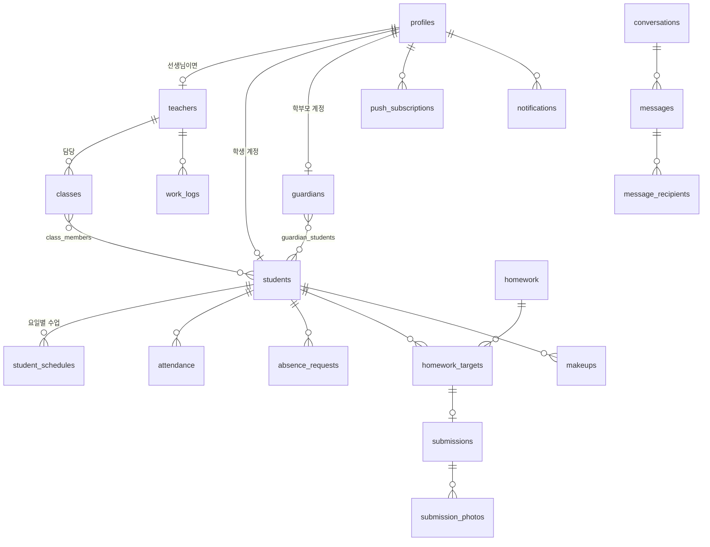

# LEET Elite 데이터 구조 설계 (초안 v0.1, 2026-09-29)

- 대상 DB: PostgreSQL (Supabase)
- 인증: Supabase Auth. 학원 발급 아이디를 내부 이메일(`{login_id}@users.leet-elite.local`)로 매핑해 이메일+비밀번호 방식으로 로그인 (전화번호 SMS 인증 없음)
- 권한: 모든 테이블에 RLS(행 단위 보안) 적용. 아래 "접근" 열 참고
- 시간: `timestamptz`로 저장, 날짜 경계는 `Asia/Seoul` 기준. 출결 날짜 같은 "하루" 개념은 `date` 컬럼에 한국 날짜로 저장
- 요구사항 ID는 `requirements.md` 참고

## 관계 개요

## 테이블

### 계정

**profiles** — 로그인 가능한 모든 사람 (auth.users 1:1)
| 컬럼 | 타입 | 설명 |
|---|---|---|
| id | uuid PK | = auth.users.id |
| role | enum `admin/teacher/student/parent/kiosk` | kiosk = 학원 입구 태블릿 (출결 입력만) |
| login_id | text unique | 학원 발급 아이디 (보통 휴대폰 번호, 예외 시 임의 문자열) AUTH-02 |
| display_name | text | 화면 표시 이름 |
| phone | text null | |
| is_active | bool | AUTH-05 |
| must_change_password | bool default true | AUTH-03 |
| created_at, updated_at | timestamptz | |

**teachers** — 선생님 부가 정보 TCH-01
| 컬럼 | 타입 | 설명 |
|---|---|---|
| id | uuid PK | |
| profile_id | uuid unique → profiles | |
| real_name | text | 원장님만 조회 |
| nickname | text | 학생·학부모에게 보이는 이름 |
| is_active | bool | |

### 학생·보호자

**students** STU-01
| 컬럼 | 타입 | 설명 |
|---|---|---|
| id | uuid PK | |
| profile_id | uuid null unique → profiles | 로그인 계정 (없을 수 있음) |
| name | text | |
| school | text null | |
| grade | text null | "초6", "중3", "고1" 형식 |
| birth_date | date null | |
| birth_calendar | enum `solar/lunar` null | 에듀OK 양/음 |
| phone | text null | 없을 수 있음, 형제 공유 가능 → unique 아님 |
| status | enum `enrolled/on_leave/withdrawn/pending` | 재원·휴원·퇴원·예정 |
| enrolled_on | date | 입학일 (미래일 수 있음 = 예정) |
| left_on | date null | 휴·퇴원일 |
| attendance_code | text (4~6자리) | 출결 코드. 전화 뒷4자리 기본, **재원생끼리 unique** (부분 unique 인덱스: status in (enrolled, pending)) STU-02, KIOSK-02 |
| programs | text[] | 클래스카드, 클래스5, 오토보카 STU-03 |
| memo | text | |
| created_at, updated_at | timestamptz | |

**student_schedules** — 학생별 수업 시간표 STU-04
| 컬럼 | 타입 | 설명 |
|---|---|---|
| id | uuid PK | |
| student_id | uuid → students | |
| weekday | smallint 0~6 | 0=일 |
| start_time | time | |
| duration_min | smallint | |
| unique(student_id, weekday, start_time) | | |

**guardians** STU-07
| 컬럼 | 타입 | 설명 |
|---|---|---|
| id | uuid PK | |
| profile_id | uuid null unique → profiles | 학부모 로그인 계정 |
| name | text | "OO맘" 같은 자유 텍스트 허용 |
| relation | enum `mother/father/other` null | |
| phone1, phone2 | text null | |

**guardian_students** — 보호자 N : 학생 M
| 컬럼 | 타입 |
|---|---|
| guardian_id → guardians, student_id → students | PK(두 컬럼) |
| is_primary | bool (보호자1) |
| notify_attendance | bool default true (ATT-08) |

### 반

**classes** CLS-01
| 컬럼 | 타입 | 설명 |
|---|---|---|
| id | uuid PK | |
| name | text unique | |
| teacher_id | uuid null → teachers | 담당 선생님 |
| weekdays | smallint[] | 수업 요일 |
| is_active | bool | |
| sort_order | int | 필터 칩 순서 |

**class_members** CLS-02
| 컬럼 | 타입 |
|---|---|
| class_id, student_id | PK |
| is_primary | bool (목록에 대표로 보이는 반) |
| joined_on, left_on | date |

> 선생님의 "담당 학생" = 담당 반(`classes.teacher_id`)에 현재 소속된(`left_on is null`) 학생. RLS 헬퍼 함수 `is_my_student(student_id)`로 구현

### 출결

**attendance** ATT-02
| 컬럼 | 타입 | 설명 |
|---|---|---|
| id | uuid PK | |
| student_id | uuid → students | |
| date | date | 한국 날짜 |
| check_in_at | timestamptz null | |
| check_out_at | timestamptz null | |
| status | enum `present/absent/not_arrived` | 정상·결석·미등원 |
| memo | text | |
| method | enum `kiosk/manual` | 키패드 입력인지 선생님 입력인지 |
| recorded_by | uuid → profiles | |
| updated_at | timestamptz | |
| unique(student_id, date) | | |

> "미등원" 자동 표시(ATT-05)는 저장하지 않고 조회 시 계산: 오늘 `student_schedules`가 있고, 시작 시간이 지났고, `attendance`가 없는 학생

**absence_requests** ATT-09
| 컬럼 | 타입 |
|---|---|
| id, student_id, guardian_id, date, reason | |
| status | enum `requested/confirmed` |
| created_at | |

### 숙제

**homework** HW-01
| 컬럼 | 타입 | 설명 |
|---|---|---|
| id | uuid PK | |
| kind | enum `general/daily` | 일반·매일 |
| title | text | 오늘 날짜 사용 시 자동 입력 HW-02 |
| body | text | |
| starts_on, ends_on | date null | 매일 숙제 기간 HW-03. 기간형은 시작~종료, 하루짜리는 시작=종료 (10/1 원장님 "둘 다") |
| created_by | uuid → profiles | |
| archived_at | timestamptz null | 제출물이 있으면 삭제 대신 보관 HW-12 |
| created_at, updated_at | timestamptz | |

**homework_targets** — 숙제 × 대상 학생
| 컬럼 | 타입 |
|---|---|
| homework_id, student_id | PK |

> "전체"나 "반 단위" 선택은 등록 시점의 학생 목록으로 펼쳐서 저장한다 (나중에 반에 들어온 학생에게 예전 숙제가 생기지 않도록)

**submissions** HW-06
| 컬럼 | 타입 | 설명 |
|---|---|---|
| id | uuid PK | |
| homework_id, student_id | → homework_targets | |
| for_date | date null | 매일 숙제면 해당 날짜, 일반 숙제면 null |
| comment | text | |
| submitted_at, updated_at | timestamptz | |
| teacher_comment | text null | HW-10 |
| teacher_comment_by | uuid null → profiles | |
| teacher_comment_at | timestamptz null | |
| unique(homework_id, student_id, for_date) | | |

**submission_photos** HW-06~08
| 컬럼 | 타입 |
|---|---|
| id, submission_id, storage_path, sort_order, width, height, created_at | |

> 저장소: 비공개 버킷 `homework-photos/{student_id}/{submission_id}/{uuid}.jpg`. 조회는 서명 URL(짧은 만료)

### 보강

**makeups** MKP-01
| 컬럼 | 타입 |
|---|---|
| id, student_id, teacher_id(null), starts_at, duration_min, reason, memo | |
| status | enum `scheduled/done/cancelled` |
| created_by, created_at | |

### 메시지

**conversations** — 대화방
| 컬럼 | 타입 | 설명 |
|---|---|---|
| id | uuid PK | |
| kind | enum `student_family/student_direct/broadcast/staff` | 학생별 학부모 대화방(MSG-04) / 학생별 학생 대화방(MSG-05) / 공지성 발송 / 선생님끼리 |
| student_id | uuid null | student_family·student_direct일 때. 학생 한 명당 각각 한 방 (unique(kind, student_id)) |
| title | text null | |

**messages**
| 컬럼 | 타입 | 설명 |
|---|---|---|
| id | uuid PK | |
| conversation_id | uuid | |
| sender_id | uuid → profiles | |
| body | text | |
| scheduled_at | timestamptz null | 예약 발송 MSG-02 |
| sent_at | timestamptz null | 예약이면 발송 시각에 채움 |
| created_at | timestamptz | |

**message_recipients** MSG-03
| 컬럼 | 타입 |
|---|---|
| message_id, profile_id | PK |
| read_at | timestamptz null |

> 예약 발송은 Supabase 예약 작업(pg_cron)이 1분마다 `scheduled_at <= now() and sent_at is null`을 찾아 발송하고 알림을 보낸다

### 선생님 출퇴근

**work_logs** TCH-03
| 컬럼 | 타입 |
|---|---|
| id, teacher_id, check_in_at, check_out_at(null), memo, edited_by(null) | |

### ~~교육비~~ — 9/29 범위에서 제외 (tuition_plans, invoices 삭제)

### 알림

**push_subscriptions** NOTI-02
| 컬럼 | 타입 |
|---|---|
| id, profile_id, endpoint unique, p256dh, auth, user_agent, created_at | |

**notification_prefs** NOTI-03
| 컬럼 | 타입 |
|---|---|
| profile_id, type | PK |
| enabled | bool |

**notifications** NOTI-05 — 앱 안 알림 목록
| 컬럼 | 타입 |
|---|---|
| id, profile_id, type, title, body, link, read_at(null), created_at | |

type: `homework_submitted`, `feedback_added`, `message`, `check_in`, `check_out`, `makeup_scheduled`, `absence_requested`

## 접근 권한 (RLS 요약)

| 테이블 | 원장 | 선생님 | 학생 | 학부모 |
|---|---|---|---|---|
| profiles | 전체 RW | 본인 R + 담당 학생·학부모 이름 R | 본인 R | 본인 R |
| teachers | 전체 RW | 본인 R | nickname만 (뷰) | nickname만 (뷰) |
| students | 전체 RW | 담당 R, programs W | 본인 R | 자녀 R |
| student_schedules | RW | 담당 R | 본인 R | 자녀 R |
| guardians / guardian_students | RW | 담당 학생의 보호자 R | - | 본인 R |
| classes / class_members | RW | 담당 R | 본인 소속 R | 자녀 소속 R |
| attendance | RW | 담당 RW | 본인 R | 자녀 R |
| absence_requests | RW | 담당 R | - | 자녀 RW(생성) |
| homework / targets | RW | 담당 학생 대상 RW | 본인 대상 R | 자녀 대상 R |
| submissions / photos | RW | 담당 R + teacher_comment W | 본인 RW | 자녀 R |
| makeups | RW | 담당 RW | 본인 R | 자녀 R |
| conversations / messages | 전체 | 참여 중인 대화 | 참여 중인 대화 | 참여 중인 대화 |
| work_logs | RW | 본인 RW(출퇴근) | - | - |
| notifications / prefs / push | 본인 | 본인 | 본인 | 본인 |

- **키패드(`kiosk`) 계정**은 어떤 테이블도 직접 읽거나 쓰지 못한다. 서버 함수 `kiosk_check(code)`만 호출할 수 있고, 이 함수가 코드로 학생을 찾아 등원·하원을 기록한 뒤 학생 이름과 시각만 돌려준다 (KIOSK-06)
- 선생님 실명은 `teachers.real_name`에 두고, 학생·학부모에게는 `teacher_public` 뷰(id, nickname)만 노출
- 계정 생성·비밀번호 재설정은 서비스 키가 필요하므로 서버 함수(원장님만 호출 가능)로 처리

## 에듀OK 이관 메모
- 이름 칸의 "홍길동(고림중3)", "홍길동 초6", "홍길동.고진중3" → name / school / grade 분리
- 상태 접두어 (재)/(휴)/(퇴) → status
- 보호자 칸 + 휴대전화1·2 → guardians. 같은 번호의 보호자는 1명으로 합치고 자녀를 여러 명 연결
- 메모의 시간표("월수 2h" 등)는 자동 변환이 어려우므로 원장님과 함께 확인하며 입력
